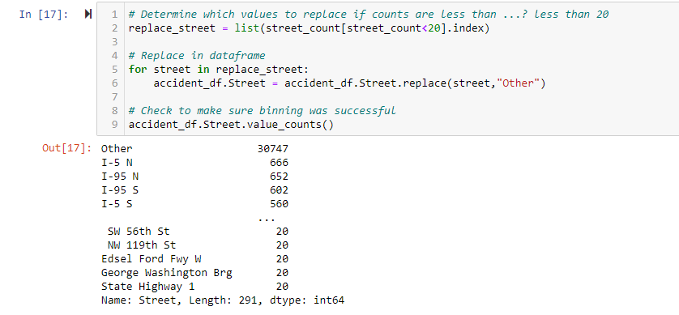
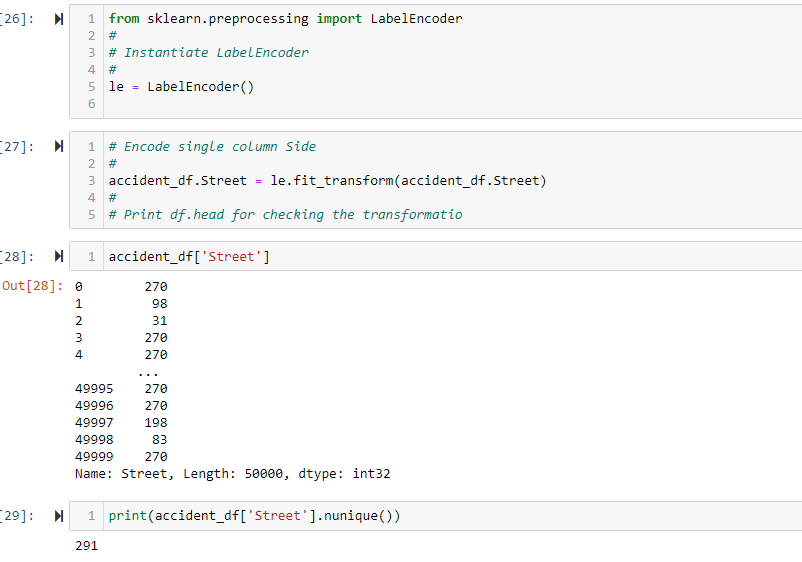
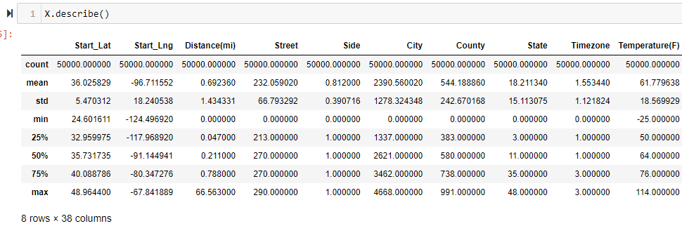
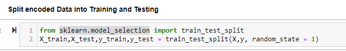
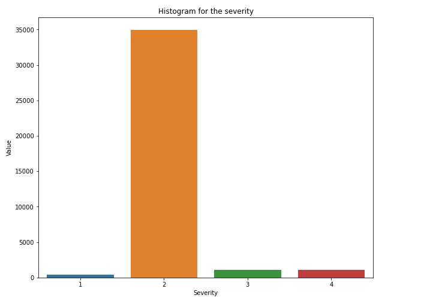
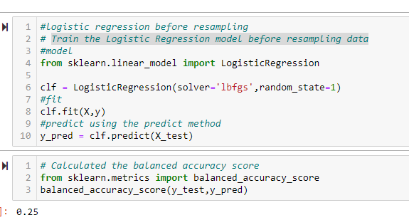

# The_Final_Project_Data_Visualization

This is the final Team 8 project for the Rutgers Data Visualization Bootcamp

# Team

Team 8:
Presentation and GitHub - Dennis Smith

Machine Learning Model - Helanga W. Hettigamage

Database - Uma K Iyer

Dashboard - Revati Kulkarni

### Table of Contents
* [Team](#team)
* [General info](#general-info)
* [Questions](#questions)
* [Data Source](#data-source)
* [ETL](#ETL)
* [Data Cleaning](#data-cleaning)
* [Database](#database)
* [Machine Learning](#machine-learning)
* [Data Visualization](#data-visualization)
* [Reports and Instructions](#reports-instructions)

# General info

Team members have drafted their project, including the following:

✓ Selected topic: The U.S. Department of Transportation’s National Highway Traffic Safety Administration released its 2021 annual traffic crash data, showing that 38,824 lives were lost in traffic crashes nationwide. That number marks the highest number of fatalities since 2007. Our team got interested in studying and analyzing about this data.

✓ Reason why they selected their topic: All of the USA heavily rely on car or some form of road transportation every day. Apart from pandemic time, our major part of the day is spend on commute in onr form or other. So road safety, accidents are the issues close to our heart. Hence our team decided to analyze and get insight from the data available from government agencies on road accidents in the USA.

# Data Source
✓ Description of their source of data: While searching for data, we came across <https://www.kaggle.com/datasets/sobhanmoosavi/us-accidents>. This is a countrywide car accident dataset, which covers 49 states of the USA. The accident data are collected from February 2016 to Dec 2021, using multiple APIs that provide streaming traffic incident (or event) data. These APIs broadcast traffic data captured by a variety of entities, such as the US and state departments of transportation, law enforcement agencies, traffic cameras, and traffic sensors within the road-networks. Currently, there are about 2.8 million accident records in this dataset. This dataset has been collected in real-time, using multiple Traffic APIs. Currently, it contains accident data that are collected from February 2016 to Dec 2021 for the Contiguous United States.

# Questions

✓ Questions they hope to answer with the data: US-Accidents can be used for numerous applications such as real-time car accident prediction, studying car accidents hotspot locations, casualty analysis and extracting cause and effect rules to predict car accidents, and studying the impact of precipitation or other environmental stimuli on accident occurrence. The most recent release of the dataset can also be useful to study the impact of COVID-19 on traffic behavior and accidents. Our team is planning to find the answers to questions such as:
* Which City in US has reported most no. of Accident Cases in last 5 years (2016-2021) ?
* Done in PostgresSQL

* Which are the top 10 accident prone streets in US ?
*  Done in PostgresSQL

* Per Day averagely how many road accidents took place in US ?
* Done in PostgresSQL

* In which hours of the day most accidents happened in US ?

* Tableu Bar Chart

* Which are the top 10 States with most no. of road accident cases in US ?
 Done in PostgresSQL
 
-
Notes: The following files were created by Uma and Helenga to describe the process for Data Prep/Cleaning and Machine Learning Stage 1

[Data Prep/Cleaning Process text file link](https://github.com/DennisPSmith5676/DataVisualization_US_Accidents/blob/DataCleaning/DataClean/ETLprocess.txt)

[Machine Learning Process text file link](https://github.com/DennisPSmith5676/DataVisualization_US_Accidents/blob/MachineLearningModel/MLStage1.txt)

# Data Cleaning
	To clean and reformat our data we used PostgresSQL and Jypter Notebook.
To get our data in a format that was needed, we had to use merge PostgresSQL and Jypter Notebook. 

Using PostgresSQL we created clean_accident_data_df. !st we had to create the schema file. Then we loaded our database. This is what we used to do all of our analysis. 
In addition to Database creation, we had to identify if we had any NaN in our data. This was most prevelant in street number column.
So we dropped the Street number as well as the following columns:

Astronomical_Twilight - Same data as Sunrise_Sunset
Civil_Twilight - Same Data as Sunrise_Sunset
Country - We are only doing usa
Description - no useful information
Nautical_Twilight - Same Data as Sunrise_Sunset

WE also added the following columns to our database

Year
Month
Day
Hour
Weekday

Here is a link to our Database files:

(https://umausdata.s3.amazonaws.com/DataFile/clean_accident_data_df.csv)

In order to do our Data Visulization we created the Geography.db, Location.db and Weather.db. Here are the links to the  CSV file output.

(https://umausdata.s3.amazonaws.com/DataFile/acci_geography.csv)

(https://umausdata.s3.amazonaws.com/DataFile/acci_location.csv)

(https://umausdata.s3.amazonaws.com/DataFile/acci_weather.csv)

# Database
In out analysis we asked the following questions in addtion to the qustions from above.

Accident_city_atstopsign_daytime
Accident_city_atstopsign_night
Count_Severity_Year
count_hour
count_year
top10_accident_city
top10_accident_state

(https://github.com/DennisPSmith5676/DataVisualization_US_Accidents/blob/DataCleaning/DataBase/queries_final.sql)

# Machine Learning

#### How we can work on this problem with machine learning!
The basic idea we had was, why not train some models on the dataset and use those models to get the feature importance to figure out which factors contribute the most to an accident. These can be weather, time of day, month of the year, and the location as some areas are more prone than others. This same approach can be used to predict accidents in real time based on user input.

#### First cut approach to the problem
Do some basic Exploratory Data Analysis to get some insights into the data;
We will be using the “Severity” feature as our target variable to train the models.
Remove some features that are highly correlated which can help us in reducing overfitting.
Create some new features by using feature engineering techniques.
Trying several feature encoding techniques based on the nature of the feature.
Over and undersampling the data as the number of points per target variable is disproportionate.
Train some models on them and get feature importance for each model.

### Segment 2:

In here we considered only 50000 records from US accidents dataset which can be found on below url
https://www.kaggle.com/datasets/sobhanmoosavi/us-accidents

#### ✓  Description of preliminary data preprocessing

This dataset contains 49 columns which means we are dealing with 49 features in total which is a little bit too much. We will try to remove some of them and maybe combine some columns into one.
 - Droped the non-beneficial columns'ID','Start_Time','End_Time','Zipcode' for machine learning process.
    - ID: since they don't carry any information for the severity
    - Start_Time,End_Time :because it was decomposed by the time features added before (day, month, weekday,Year).
    - Zipcode :because we just focus on the City,County,state where the accident happened.
  - Dropped the Null values
- Now this dataset contains 39 columns.

 
#### ✓ Description of preliminary feature engineering 

 - Street column has 17079 unique values, so used binning to catogerised the values of the Street column,
    If value count of Street less than 20 then catogerize as "Other".
    
    
    
  - Used Label Encoding  to converte the catogerical columns  into a numeric form so as to convert them into the machine-readable form. 
    Machine learning algorithms can then decide in a better way how those labels must be operated.  
    
    
    
  - Features variance
  - checked the variance for each feature in order to remove features with a very low variance beacuse they can't help to discriminate instances.
     
     
   
  
#### ✓ Description of how data was split into training and testing sets
 
 - train_test_split is a function in Sklearn model selection for splitting data arrays into two subsets: 
for training data and for testing data. With this function, we don't need to divide the dataset manually. 
By default, Sklearn train_test_split will make random partitions for the two subsets.

    
    
 ####  ✓ Explanation of model choice
 
 The severity attribute as we can see from the  plot is highly unbalanced, the number of accident with the severity 1 is very small instead the number of accident with severity 2 is much higher.
 
 
 Train the Logistic Regression model  and calculated the accuracy score before resampling the data.
 
 
 
 The acciracy score value calculated from logistic regression is very low that excepted.So we are moving into resampling techniques.
 
 #####  Random Oversampling
 In random oversampling, instances of the minority class are randomly selected and added to the training set until the majority and minority classes are balanced.
 
 In this section,compared two oversampling algorithms to determine which algorithm results in the best performance.And oversampled the data using Naive random over sampling algorithm and the SMOTE algorithm.
    
 ###### Naive Random Oversampling Algorithm
  
 
   
Balnce Accuracy Score:
 

    
 ##### Undersampling
 
 Undersampling is another technique to address class imbalance.Undersampling takes the opposite approach of oversampling. Instead of increasing the number of the minority class, the size of the majority class is decreased.
 
 In this section, tested an undersampling algorithms to determine which algorithm results in the best performance compared to the oversampling algorithms above.
 undersampled the data using the Cluster Centroids algorithm.
 
 ##### Combination of Over and Under Sampling
 
 In this section, tested a combination over- and under-sampling algorithm to determine if the algorithm results in the best performance compared to the other sampling algorithms above. Resampled the data using the SMOTEENN algorithm 
 
 ##### Balanced Random Forest Classifier
 Random forest classifiers are a type of ensemble learning model that combines multiple smaller models into a more robust and accurate model. 
   Random forest models use a number of weak learner algorithms (decision trees) and combine their output to make a final classification (or regression) decision. Structurally speaking, random forest models are very similar to their neural network counterparts. 
   
   Random forest models have been a staple in machine learning algorithms for many years due to their robustness and scalability. Both output and feature selection of random forest models are easy to interpret, and they can easily handle outliers and nonlinear data.
 
 Random forest classifier Accuracy score:
 
 
 
 Feature impotency:
 
 
 
 According to the graph the most importent features for Accident sevirety are time_duration,Distance,Year,Start_Lng
 
 After comparing accuracy scores on  over sampled ,under sampled and Random Forest Classifier algorithems,  we desided to proceed with Navia Over Sampling Technique and Random Forest Classifier for entire US accident datset.
# ETL 

Here is our ERD diagram of the tables used in this analysis

Model building and feature engineering
We now have some necessary insights into the dataset so, we can move on to modelling and experimentation along with some feature engineering since this is a machine learning task.

New features
We can start with adding some new features based on time of day and month etc. as these things seem to be highly relevant in predicting the accident severity.
We’ll then remove some outliers and negative features. Also, we should drop the features with a high number of null values since those can add noise to the models.

We didn’t do one-hot encoding of any features due to large number of possible values for most features and computational limitations, but it can be tried if you have the resources to run it. We encoded some features with value counts.

Over and under-sampling of data points
Through the EDA above, we can clearly notice that the class distribution in this dataset is very imbalanced. This is due to the fact that the lowest and highest severity accidents don’t occur as often as compared to other two severities so we don’t have adequate data for those classes. This means if we used the data in its existing condition then the model may never give predictions which have those probabilities. To counter this we will try to under sample the over represented classes and over sample the under represented classes. This wouldn’t completely get rid of the problem but it’s better than nothing.

We used RandomUndersampler method of the imblearn library as we have adequate points for those classes and it wouldn’t hurt to just randomly get rid of some of those points and use SMOTE method to over sample as it is the most robust of all the over sampling methods currently available to us. This process can be done in only a few lines of code as given below:

We can see that Random ForestRandom Forest response encoding and resampling gives us the best results out of all the models we tested. So, we can conclude that this combination is the best for this dataset.

# Data Visualization

# Reports and Instructions
  
## Google Slides - This is the link top our presentation.
  [Google Slides file link](https://docs.google.com/presentation/d/1BbW_9SDosgocGcgVJXc93XC9Y5BanCLbL863OFvCy94/edit?usp=sharing)

## Comunication  
✓ Description of the communication protocols: We are meeting 5 times a week and reviewing all changes before we commit the code and files to the main branch.

## Instructions
	In order for our presentation to work you will need to use ther following link:
 

## Further Improvements:
One-hot encoding can be tried for some of the features.
Weighted XGBoost and other similar models can be implemented instead of resampling the dataset.
Some basic MLP model to compare against our best model here.

References:
  
<https://arxiv.org/pdf/1906.05409.pdf>

<https://smoosavi.org/datasets/us_accidents>

<https://arxiv.org/pdf/1909.09638.pdf>

<https://medium.com/@pushkarmandot/https-medium-com-pushkarmandot-what-is-lightgbm-how-to-implement-it-how-to-fine-tune-the-parameters-60347819b7fc>

Acknowledgements:
Moosavi, Sobhan, Mohammad Hossein Samavatian, Srinivasan Parthasarathy, and Rajiv Ramnath. “A Countrywide Traffic Accident Dataset.”, 2019.

Moosavi, Sobhan, Mohammad Hossein Samavatian, Srinivasan Parthasarathy, Radu Teodorescu, and Rajiv Ramnath. "Accident Risk Prediction based on Heterogeneous Sparse Data: New Dataset and Insights." In proceedings of the 27th ACM SIGSPATIAL International Conference on Advances in Geographic Information Systems, ACM, 2019.
in Geographic Information Systems, ACM, 2019.
