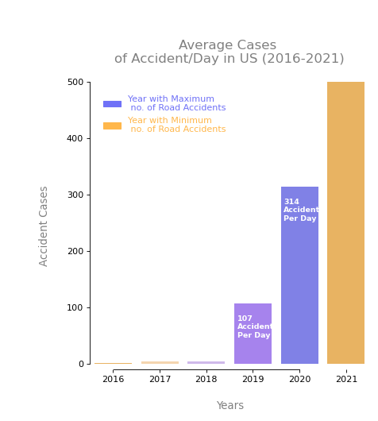

# Questions

✓ Questions they hope to answer with the data: US-Accidents can be used for numerous applications such as real-time car accident prediction, studying car accidents hotspot locations, casualty analysis and extracting cause and effect rules to predict car accidents, and studying the impact of precipitation or other environmental stimuli on accident occurrence. The most recent release of the dataset can also be useful to study the impact of COVID-19 on traffic behavior and accidents. Our team is planning to find the answers to questions such as:

* Total number of Accidents by Year

* Which are the top 10 States with most no. of road accident cases in US ?

* Which top 10 Cities in US has reported most no. of Accident Cases in last 5 years (2016-2021) ?

* Which are the top 10 accident prone streets in US ?
  

* Per Day averagely how many road accidents took place in US ?

* In which hours of the day most accidents happened in US ?
 

# Data Cleaning
To clean and reformat our data we used PostgresSQL and Jupyter Notebook.
To get our data in a format that was needed, we had to use merge PostgresSQL and Jupyter Notebook.

Using PostgresSQL we created clean_accident_data_df. 1st we had to create the schema file. Then we loaded our database. This is what we used to do all of our analysis.
In addition to Database creation, we had to identify if we had any NaN in our data. This was most prevalent in street number column.
So we dropped the Street number as well as the following columns:

Astronomical_Twilight - Same data as Sunrise_Sunset

Civil_Twilight - Same Data as Sunrise_Sunset

Country - We are only doing usa

Description - no useful information

Nautical_Twilight - Same Data as Sunrise_Sunset

We also added the following columns to our database:

Year

Month

Day

Hour

Weekday

Here is a link to our Database files:

(https://umausdata.s3.amazonaws.com/DataFile/clean_accident_data_df.csv)

In order to do our Data Visualization we created the Geography.db, Location.db and Weather.db. Here are the links to the  CSV file output.

(https://umausdata.s3.amazonaws.com/DataFile/acci_geography.csv)

(https://umausdata.s3.amazonaws.com/DataFile/acci_location.csv)

(https://umausdata.s3.amazonaws.com/DataFile/acci_weather.csv)

# Database

In out analysis we asked the following questions in addition to the questions from above.

Accident_city_atstopsign_daytime

Accident_city_atstopsign_night

Count_Severity_Year

count_hour

count_year

top10_accident_city

top10_accident_state

Here is the code to th above visualizations:

(https://github.com/DennisPSmith5676/DataVisualization_US_Accidents/blob/DataCleaning/DataBase/queries_final.sql)

# Machine Learning

#### How we can work on this problem with machine learning!
The basic idea we had was, why not train some models on the dataset and use those models to get the feature importance to figure out which factors contribute the most to an accident. These can be weather, time of day, month of the year, and the location as some areas are more prone than others. This same approach can be used to predict accidents in real time based on user input.

#### First cut approach to the problem
Do some basic Exploratory Data Analysis to get some insights into the data;
We will be using the “Severity” feature as our target variable to train the models.
Remove some features that are highly correlated which can help us in reducing overfitting.
Create some new features by using feature engineering techniques.
Trying several feature encoding techniques based on the nature of the feature.
Over and undersampling the data as the number of points per target variable is disproportionate.
Train some models on them and get feature importance for each model.

### Segment 2:

In here we considered only 50000 records from US accidents dataset which can be found on below url
https://www.kaggle.com/datasets/sobhanmoosavi/us-accidents

#### ✓  Description of preliminary data preprocessing

code for this section:https://github.com/DennisPSmith5676/DataVisualization_US_Accidents/blob/MachineLearningModel/mock_accident.ipynb

This dataset contains 49 columns which means we are dealing with 49 features in total which is little bit too much. We will try to remove some of them and maybe merge some columns in a meaningful way.
 - Droped the non-beneficial columns such as 'ID','Start_Time','End_Time','Zipcode' for machine learning process.
    - ID : Since ID doesn't carry any information for the severity.
    - Start_Time,End_Time : Because it has already been decomposed to calculate other time features such as day, month, weekday and Year.
    - Zipcode : Because we just focus on the City,County and State where the accident happened.
 - Dropped the Null values
 - After the pre-processing, the dataset now contains 39 columns.

 
#### ✓ Description of preliminary feature engineering 

After deleting the non-beneficial columns,this dataset contains 7 categorical columns. i.e (street,side,city,county,state,sunrise_sunset & month)

##### Binning

Binning method is used to smoothing data or to handle noisy data.
 - If we consider all catogerical columns, the Street column as a highst nunber of unique values, that is 17079. So used binning to catogerised the values of the Street column,
  
 - Choose value count of Street less than 20 then categorize as "Other".the reason to chose less than 20 is less than 20 streets doesn't contain any major highways.
        
##### Label Encoding vs  One-Hot Encoding

 

Machines Learning Algorithms  understand numbers, not text. We need to convert each text category to numbers in order for the machine learning  to process them using mathematical equations.

Ever wondered how we can do that? What are the different ways?This is where Label Encoding and One-Hot Encoding come into the picture.

Label Encoding is a popular encoding technique for handling categorical variables. In this technique, each label is assigned a unique integer based on alphabetical ordering.

One-Hot Encoding is another popular technique for treating categorical variables. It simply creates additional features based on the number of unique values in the categorical feature. Every unique value in the category will be added as a feature.

As this is very large data set with 39 columns and number of unique values in  each categorical column is quite large as one-hot encoding can lead to high memory consumption.Considering that we choose Label Encoding using Scikit-Learn library to convert categorical values to numerical.

Though label encoding is straight but it has the disadvantage that the numeric values can be misinterpreted by algorithms as having some sort of hierarchy/order in them.

#### ✓ Description of how data was split into training and testing sets - train_test_split is a function in Sklearn model selection for splitting data arrays into two subsets: 
For training data and for testing data. With this function, we don't need to divide the dataset manually.
By default, Sklearn train_test_split will make random partitions for the two subsets.

  
 ####  ✓ Explanation of model choice

 The severity attribute as we can see from the  plot is highly unbalanced, the number of accident with the severity 1 is very small instead the number of accident with severity 2 is much higher.

 The simplest way to fix imbalanced dataset is simply balancing them by oversampling instances of the minority class or undersampling instances of the majority class.

 #####  Random Oversampling
 In random oversampling, instances of the minority class are randomly selected and added to the training set until the majority and minority classes are balanced.

 Compared two oversampling algorithms Naive random over sampling algorithm and the SMOTE algorithm to determine which algorithm results in the best performance.
 ###### Naive Random Oversampling Algorithm
  
 
Balance Accuracy Score:

 ##### Undersampling

 Undersampling is another technique to address class imbalance.Undersampling takes the opposite approach of oversampling. Instead of increasing the number of the minority class, the size of the majority class is decreased.
 
 Tested an undersampling algorithms to determine which algorithm results in the best performance compared to the oversampling algorithms above.
 undersampled the data using the Cluster Centroids algorithm and it only gave accuracy score of 39.65%.

 ##### Combination of Over and Under Sampling

 Combination over- and under-sampling algorithm used to determine if the algorithm results in the best performance compared to the other sampling algorithms above. Resampled the data using the SMOTEENN algorithm and gave 44.58% of accuracy score.

##### Balanced Random Forest Classifier

 Random forest classifiers are a type of ensemble learning model that combines multiple smaller models into a more robust and accurate model.
   Random forest models use a number of weak learner algorithms (decision trees) and combine their output to make a final classification (or regression) decision. Structurally speaking, random forest models are very similar to their neural network counterparts.

  Random forest models have been a staple in machine learning algorithms for many years due to their robustness and scalability. Both output and feature selection of random forest models are easy to interpret, and they can easily handle outliers and nonlinear data.
 
 Random forest classifier Accuracy score:
 
 
 
 We can see that Random ForestRandom Forest response encoding and resampling gives us the best results out of all the models we tested. So, we can conclude that this combination is the best for this dataset.
 
 Great thing Random Forest classifier is  it gives most importance features and it has emerged as a quite useful algorithm that can handle the feature selection issue even with a higher number of variables.
 
 Feature impotency:
 
 
 
 According to the graph the top 10 important features for Accident severity are time_duration,Distance,Year,Start_Lng,Pressure,State,City,County,Humidity and Windchill.
 
And least impotence features are Roundabout,Turning_Loop,Bump,Traffic_Calming and 'No_Exit'.

##### Easy Ensemble AdaBoost classifier

AdaBoost is a boosting ensemble model and works especially well with the decision tree. Boosting model's key is learning from the previous mistakes, e.g. misclassification data points. AdaBoost learns from the mistakes by increasing the weight of misclassified data points.

Ensemble AdaBoost classifier also gave 61% accuracy score for mock accidents dataset.

Comparing All Accuracy scores:

 After comparing accuracy scores on  over sampled ,under sampled Random Forest Classifier algorithms and Ensemble AdaBoost classifier we decided to proceed with Easy Ensemble AdaBoost classifier and Random Forest Classifier for entire US accident dataset.

### Segment 3:
* Team decided to use three algorithms (Navia random Oversampling RFC and Easy Adbooster Classifier) with highest accuracy score for the testing of whole dataset.
* Not only the algorithm, we drop the least five features 'No_Exit', 'Traffic_Calming', 'Roundabout','Bump', 'Turning_Loop' from RFC feature impotence when going for whole dataset.
* When considering whole dataset the  dropped the column Street as it is too much noisy.

* For whole dataset Random forest Classifier gives 83% accuracy score and 87% f1 score. 
* Accordingly it become the best algorithm to predict accident severity in our dataset.

This is the link to the segment 3 Jupyter nOtebook:

https://github.com/DennisPSmith5676/DataVisualization_US_Accidents/blob/main/MachineLearning/ML_US_accident_dataset.ipynb

Note: Please run one algorithm at a time as this is a very large Dataset.

# ERD 

Here is our ERD diagram of the tables used in this project

# Data Visualization

* After selecting data source, doing elementary data analysis, we cleaned the data and created a database with ERD diagrams in postgres and uploaded the database to AWS.

* After that we asked the questions about how to incorporate our knowledge of machine learning to solve the questions we have during EDA.The basic idea we had was, why not train some models on the dataset and use those models to get the feature importance to figure out which factors contribute the most to an accident. We realized that "Severity" of the accident is the most important feature og our data and so many factors affect it. So we run the ML models on mock dataset and then cleaned real dataset.
* After finding the feature importance's, we came to the data visualization. We realized that we could do static visualization in Tableau and dynamic visualization using javascript, flask, python, html,css,leaflet,and swagger.

* With extensive documentation available online, module content from the bootcamp, and brainstorming about visualization, we decided to focus on accident count to be displayed according to year and severity. Then decided to incorporate different factors to display on the maps for specific co-ordinates.

* Our dashboard looks like this :

.png)

* Here we take user input in the form of year and severity and display accident count and since it's a big data, part of that count on the map.    * When we click on each location, humidly, pressure,temperature,wind chill will be displayed for that accident.
* On the dashboard, we provided link to the Tableau and we can see the story of US Accident between 2016-2021.

.png)

* For further enhancement, we would like to implement more features on the dashboard and want to figure out how to reduce the time and memory to fetch the data.

# Reports and Instructions
  
## Google Slides - This is the link to our presentation.
  [Google Slides file link](https://docs.google.com/presentation/d/1BbW_9SDosgocGcgVJXc93XC9Y5BanCLbL863OFvCy94/edit?usp=sharing)

## Tableau Slides - This is the link to our images and visulizations from Tableau.
[Tableau file link](https://public.tableau.com/app/profile/uma.iyer/viz/DataVisualtization/County?publish=yes)

## Comunication  
✓ Description of the communication protocols: We are meeting 5 times a week and reviewing all changes before we commit the code and files to the main branch.

 Notes: The following files were created by Uma and Helenga to describe the process for Data Prep/Cleaning and Machine Learning Stage 1

[Data Prep/Cleaning Process text file link](https://github.com/DennisPSmith5676/DataVisualization_US_Accidents/blob/DataCleaning/DataClean/ETLprocess.txt)

[Machine Learning Process text file link](https://github.com/DennisPSmith5676/DataVisualization_US_Accidents/blob/MachineLearningModel/MLStage1.txt)

## Instructions
	In order for our presentation to work you will need to use ther following link:
 

## Further Improvements:
One-hot encoding can be tried for some of the features.
Weighted XGBoost and other similar models can be implemented instead of resampling the dataset.
Some basic MLP model to compare against our best model here.

References:
  
<https://arxiv.org/pdf/1906.05409.pdf>

<https://smoosavi.org/datasets/us_accidents>

<https://arxiv.org/pdf/1909.09638.pdf>

<https://medium.com/@pushkarmandot/https-medium-com-pushkarmandot-what-is-lightgbm-how-to-implement-it-how-to-fine-tune-the-parameters-60347819b7fc>

Acknowledgements:
Moosavi, Sobhan, Mohammad Hossein Samavatian, Srinivasan Parthasarathy, and Rajiv Ramnath. “A Countrywide Traffic Accident Dataset.”, 2019.

Moosavi, Sobhan, Mohammad Hossein Samavatian, Srinivasan Parthasarathy, Radu Teodorescu, and Rajiv Ramnath. "Accident Risk Prediction based on Heterogeneous Sparse Data: New Dataset and Insights." In proceedings of the 27th ACM SIGSPATIAL International Conference on Advances in Geographic Information Systems, ACM, 2019.
in Geographic Information Systems, ACM, 2019.

